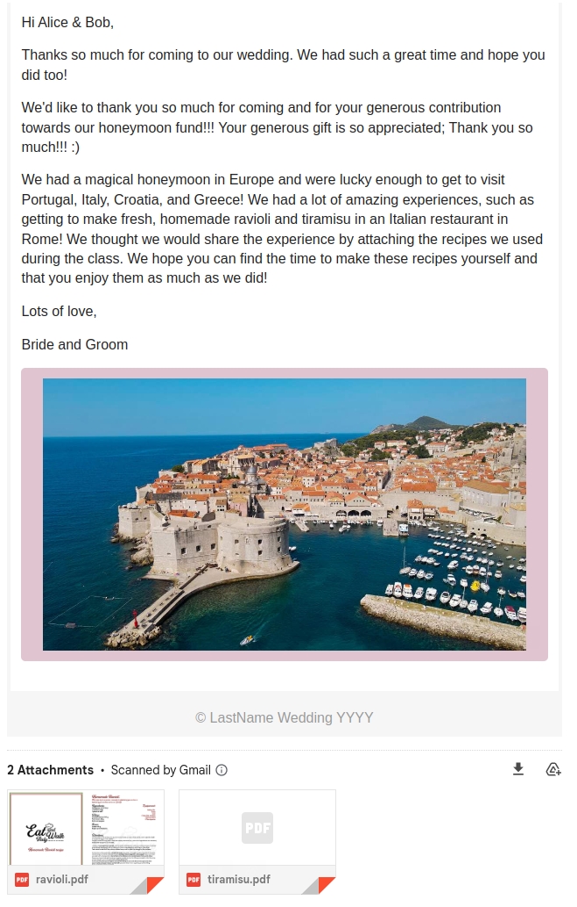

# Thank You Letters

This application reads party / guest information from a CSV file and sends each party an HTML-formatted "Thank You" 
email with the contents built from a template and customized based on their gift (if provided).

## Usage

The application can be run as follows:

```shell
cargo run --package thank-you-letters --bin thank-you-letters -- \
  --input-file input.csv \
  --smtp-username email@domain.com \
  --smtp-password supersecretpassword \
  --smtp-server server@domain.com \
  --from "Bride and Groom <email@domain.com>" \
  --image-path honeymoon.jpeg \
  --attachment ravioli.pdf \
  --attachment tiramisu.pdf
```

All arguments are required except for attachments which are optional. As many attachment arguments as desired can be
added. 

## Remarks

Obviously this repo can not be reused exactly as is... The email template is not generic and must be tailored how you
would like it.

## Proof



